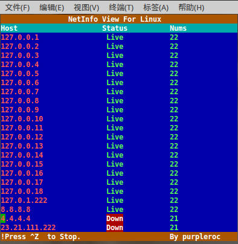

NetInfo
==

NetInfo是一个基于开源项目再开发的小工具。用于linux下实现批量ip存活检测。  
改造NetInfo的动机来源于前几天一个同学问我Linux下有没有类似Windows下的PingInfo View之类的，能够方便运维、网络管理员、网络优化员等对网络在线主机进行实时监控的工具。  
其实我当时是没想到这答案的，后来想了想，fping的-l选项可以或许可以满足。但输出似乎不太满意。便推荐该同学自己写脚本实现。   
之后，今天下午看了看fping源码，用拙劣的手段改造了一个出来，希望能满足需求。  



##Installation
克隆NetInfo到本地：

    git clone https://github.com/purpleroc/NetInfo

编译需gcc编译环境：

    sudo apt-get install build-essential

在有gcc编译环境的情况下，执行下面的命令，即可完成编译：

    chmod +x make.sh
    ./make.sh

##Usage

```
 Usage: ./netinfo [options] [targets...]
   -f file    read list of targets from a file ( - means stdin) (only if no -g specified)
   -g         generate target list (only if no -f specified)
                (specify the start and end IP in the target list, or supply a IP netmask)
                (ex. ./netinfo -g 192.168.1.0 192.168.1.255 or ./netinfo -g 192.168.1.0/24)
   -v         show version
   targets    list of targets to check (if no -f specified)
```

##Example

    ./netinfo 127.0.0.1
    ./netinfo 8.8.8.8 127.0.0.1
    ./netinfo -g 127.0.0.1 127.0.0.10
    ./netinfo -g 127.0.0.1/24
    ./netinfo -f ip_list.txt

##Enjoy it!
